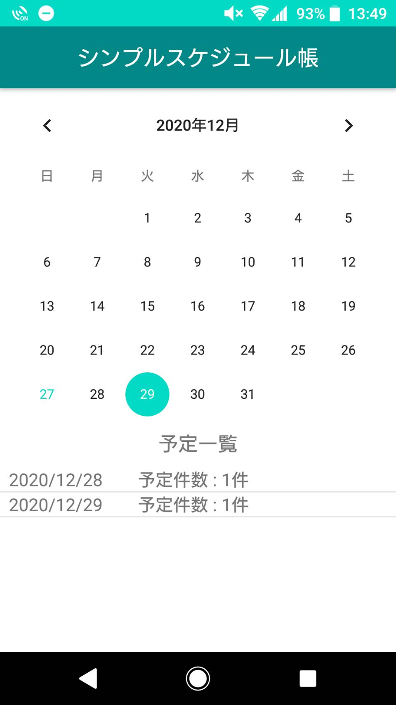
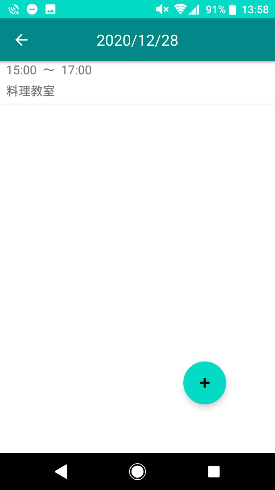
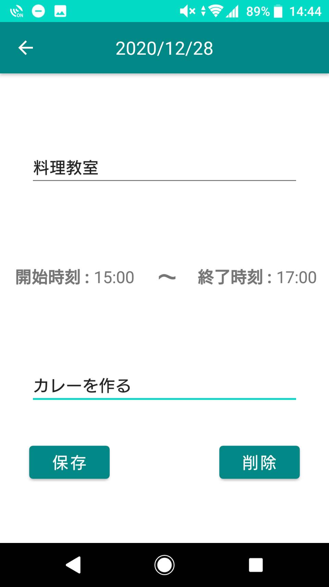
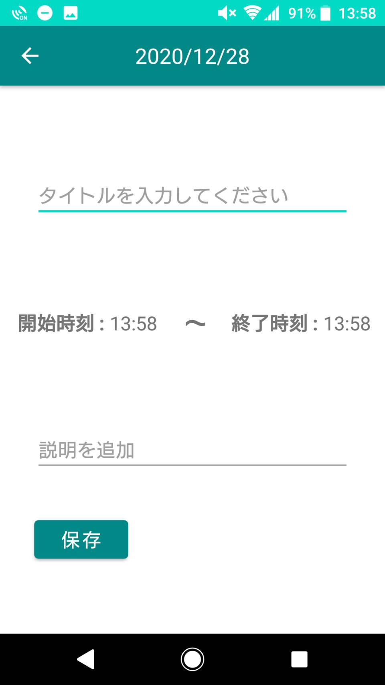
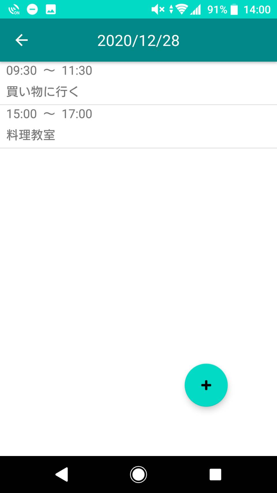
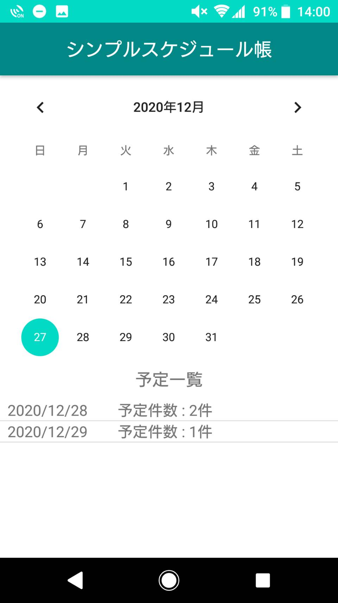

# シンプルスケジュール帳

- 使用言語：Kotlin
- フレームワーク：MVVM
- データベース：Room
- スキル：LiveData・Coroutines・DataBinding

## 概要
Kotlinを用いたAndroidアプリです。
 シンプルなスケジュール管理用のアプリケーションで、カレンダーの日付を選択し、予定を追加/削除します。

## 使用方法
### 1. 日付の選択
アプリを起動すると、カレンダーと前回書いた予定の一覧がリストとして表示されます。
 リストには日単位の予定件数が表示されます。
 カレンダーかリストをタップして、予定を追加/削除する日付を選択します。
 
 
### 2. 予定の選択
選択した日付がツールバーのタイトルとして表示されます。
 画面下の丸ボタン（FAB）をタップすると新しい予定を追加し、リストをタップするとその予定内容を変更します。
 
 
### 3. 予定の追加・変更・削除
リストをタップすると前回設定した予定の内容が表示され、FABをタップすると新しい予定を表示されます。
 予定の内容はタイトル・開始/終了時刻・タイトルの説明があります。
 新しい予定を追加したときは現在の時間が開始/終了時刻に表示されます。
 保存ボタンを押すことで予定を追加/変更し、削除ボタンを押すことで予定を削除します。
  
### 4. 予定の更新
新しい予定を追加すると**１**と**２**のリスト内容が変化します。
  
